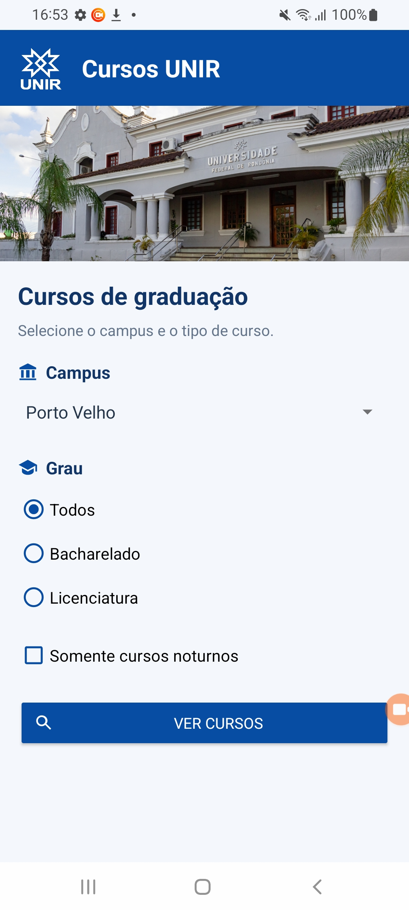
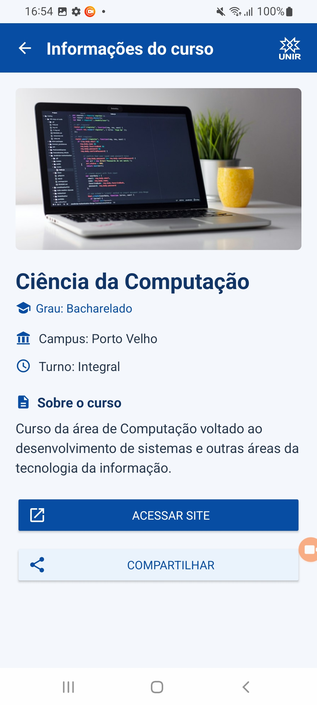

# Cursos UNIR

**Aluno:** Cauã Henrique Feitosa de Souza  
**Disciplina:** Programação à Dispositivos Móveis  
**Curso:** Ciência da Computação — Universidade Federal de Rondônia (UNIR)

Aplicativo Android para consultar os cursos de graduação da UNIR. O aplicativo faz parte de uma atividade avaliativa que reúne os conteúdos trabalhados na disciplina, como interfaces XML, Activities, Intents, RecyclerView e carregamento de imagens com Glide.

## Funcionalidades

- Filtrar cursos por campus, grau e turno noturno.
- Visualizar os cursos em uma lista com imagens.
- Consultar as informações de cada curso.
- Acessar o site e compartilhar o curso.

## Tecnologias

Java, XML, Android Studio, RecyclerView e Glide.  
SDK mínimo: 31 · SDK alvo: 37.

## Telas do aplicativo

| Tela inicial | Lista de cursos | Detalhes do curso |
| --- | --- | --- |
|  |  |  |

## Como executar

1. Abra a pasta do projeto no Android Studio.
2. Aguarde a sincronização do Gradle e instale os SDKs solicitados.
3. Execute em um emulador ou aparelho com Android 12 ou superior.
